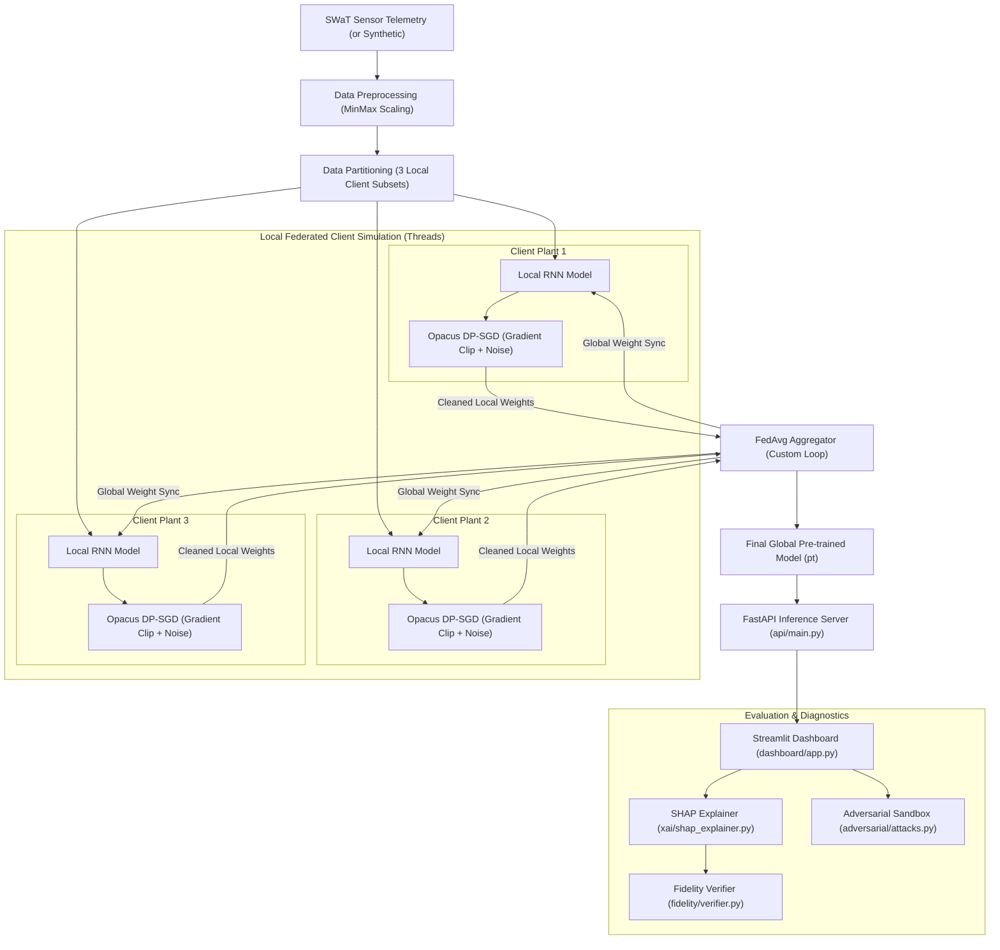

# 🛡️ Explainable AI–Based Threat Modeling for Trustworthy Cyber–Physical Systems under Intelligent Adversaries

An end-to-end, privacy-preserving, and explainable Machine Learning threat detection framework designed for industrial Cyber-Physical Systems (CPS). This project simulates a decentralized threat modeling and anomaly detection pipeline using the real-world **SWaT (Secure Water Treatment) dataset** to identify cyber-physical attacks on critical water infrastructure while evaluating client privacy bounds, explainability (XAI), and model robustness.

> [!IMPORTANT]
> **Resource & Execution Notice**: Training federated deep learning models on nearly 1,000,000 rows of SWaT sensor telemetry requires significant GPU resources. This repository is structured for **lightweight local validation and verification**. It includes pre-trained model weights, configuration templates, and cached evaluation metrics. **Local retraining is disabled by default to prevent hardware performance degradation.**

---

## 📖 Project Overview

### The Problem We Solve
Industrial Control Systems (ICS) and SCADA networks managing critical infrastructure face physical process manipulation attacks (e.g., overriding water pumps, altering tank valves). Building robust, trustable anomaly detectors for these environments is difficult due to:
1. **Data Silos & Privacy**: Local plants cannot centralize raw sensor telemetry due to strict industrial security regulations and confidentiality agreements.
2. **Explainability Deficit**: Control room operators cannot trust a black-box model. Alarms must be explained by highlighting the exact sensors driving the anomaly.
3. **Adversarial Vulnerability**: Adversaries can craft minor, mathematically optimized perturbations (noise) to inject into sensor feeds, masking physical damage from the AI system.

### The Solution
This project implements a local multi-client thread-based simulation of **Federated Learning** integrated with **Differential Privacy (DP-SGD)**. Local plants keep their telemetry private and only share model weight updates, which are aggregated via the **FedAvg** strategy. The global model is analyzed through a **SHAP Explainability** module with mathematical **Fidelity Verification** and tested against evasion attacks in an **Adversarial Sandbox**.

---

## 🛠️ Key Features

* **🏋️ Federated Simulation Loop**: Simulates decentralized training across 3 independent water treatment plants locally using a custom thread-level parameter aggregation loop (`_weighted_fedavg`).
* **🔒 Differential Privacy (DP)**: Integrates `Opacus` on local client model copies to bound sample influence (gradient clipping) and inject Gaussian noise, providing mathematically provable privacy guarantees against weight-inversion attacks.
* **🔍 Explainable AI (SHAP)**: Uses Kernel SHAP to compute contribution scores for each sensor in the SCADA pipeline, mapping which sensors triggered an alarm.
* **🧪 Fidelity Verification**: A custom verifier that masks high-importance sensors to measure confidence drops, mathematically proving if SHAP explanations align with actual model logic.
* **⚔️ Adversarial Sandbox**: Evaluates global model resilience against Fast Gradient Sign Method (FGSM) and Projected Gradient Descent (PGD) evasion attacks generated using the **Adversarial Robustness Toolbox (ART)**.
* **💻 FastAPI & Streamlit Stack**: Serves predictions, explanations, and robustness tests via a local API server and a visual monitoring dashboard.
* **☁️ Database Logging**: Connects to **MongoDB Atlas Cloud** to archive hyperparameters, metrics, and XAI evaluations for compliance auditing.

---

## 📊 System Architecture & Visual Documentation

### System Architecture Workflow
This diagram represents the actual implemented codebase execution flow: loading and partitioning the SWaT data, simulating local client training with Opacus differential privacy, aggregating weights, and serving the model through the API and diagnostic dashboard.



### Explanation of Visual Workflows
1. **Telemetry Preprocessing**: Data is min-max normalized and segment-windowed before partitioning. Splitting prior to windowing prevents data leakage across training phases.
2. **Federated Aggregation**: Local plants train their client models for a specified number of epochs. Opacus clips gradients and injects noise. The weights are cleaned of the Opacus `_module.` prefix and sent to the custom loop aggregator, which runs a weighted FedAvg algorithm.
3. **API & Monitoring**: The consolidated global model weights are saved to disk and loaded by the FastAPI service. The Streamlit dashboard interfaces with API endpoints to perform real-time diagnostic checks (predicting attacks, generating explanations, and running evasion attacks).

---

## 📁 Repository Directory Structure

```
.
├── .env.example            # Environment variables template
├── .gitignore              # Git patterns file (excludes venv, secrets, developer runs)
├── Dockerfile              # Containerization for API service
├── README.md               # Production documentation
├── colab_guide.md          # Guide for training on Google Colab GPUs
├── docker-compose.yml      # Orchestrates API and Dashboard containers
├── regenerate_results.py   # Script to verify cached metrics on local CPU
├── requirements.txt        # Python libraries list
├── setup.py                # Package setup file
│
├── adversarial/            # Adversarial robustness attacks and evaluations
│   ├── attacks.py          # FGSM and PGD mathematical attack generators
│   └── evaluation.py       # Robustness calculation algorithms
│
├── api/                    # FastAPI Backend Service
│   ├── main.py             # Server endpoints & startup initialization
│   └── schemas.py          # Pydantic data schemas
│
├── config/                 # YAML configuration parameters
│   ├── colab.yaml          # Parameters for GPU-based training
│   ├── default.yaml        # Standard parameters for dataset parsing
│   └── local.yaml          # Small synthetic test parameters
│
├── dashboard/              # Streamlit Web Application
│   └── app.py              # Front-end components, time-series, charts, forms
│
├── data/                   # Data handlers
│   ├── loader.py           # Unified data loader (Kaggle, CSV, Synthetic)
│   └── synthetic_generator.py # Normal/attack synthetic data generator
│
├── database/               # Database handlers
│   ├── connection.py       # MongoDB Atlas driver connections and CRUD
│   └── models.py           # Database schemas for metrics
│
├── experiments/            # Experiment trackers and results
│   └── results/            # Pre-trained models and saved metric JSONs
│       ├── colab_config.yaml
│       ├── colab_scaler.pkl
│       ├── colab_trained_model.pt
│       └── experiment_results.json
│
├── federated/              # Federated learning pipeline
│   ├── client.py           # Local client model setup (Flower NumPyClient)
│   ├── server.py           # Simulation runner and parameter aggregation
│   └── strategy.py         # Federated strategy structures
│
├── fidelity/               # XAI fidelity evaluation
│   └── verifier.py         # Feature masking verification routines
│
├── models/                 # Neural Network implementations
│   ├── elman_rnn.py        # Elman RNN architecture
│   ├── gru_model.py        # GRU Model alternative architecture
│   └── wrapper.py          # PyTorch-to-Scikit wrapper for ART compatibility
│
├── notebooks/              # Google Colab notebooks
│   └── colab_training.py   # Code script for GPU notebook execution
│
├── preprocessing/          # Dataset cleaning & structuring
│   ├── pipeline.py         # Combined preprocessing steps
│   └── windowing.py        # Sliding window 3D tensors generator
│
├── privacy/                # Privacy protection
│   └── dp_engine.py        # Opacus differential privacy utility wrappers
│
├── tests/                  # Automated verification tests
│   └── test_all.py         # Unit tests checking the pipeline modules
│
└── xai/                    # Explainable AI tools
    ├── shap_explainer.py   # Kernel SHAP explanations calculator
    └── visualizations.py   # Horizontal contribution charts generator
```

---

## 🚀 Installation & Running the Project

### 1. Prerequisites
Ensure you have **Python 3.10+** installed.

### 2. Setup the Environment
Clone the repository and set up a virtual environment:
```bash
# Clone the repository
git clone https://github.com/your-username/cps-security-project.git
cd cps-security-project

# Create and activate virtual environment
python3 -m venv venv
source venv/bin/activate  # Windows: venv\Scripts\activate

# Install dependencies
pip install -r requirements.txt
```

### 3. Configure Credentials (Optional)
Copy the template configuration file to `.env`:
```bash
cp .env.example .env
```
Open `.env` and fill in your values. If you do not have Kaggle credentials, the project will automatically fall back to generating **synthetic sensor data** for local tests.

### 4. Running the Backend API
Start the FastAPI server:
```bash
python -m uvicorn api.main:app --host 0.0.0.0 --port 8000
```
The interactive API documentation will be available at [http://localhost:8000/docs](http://localhost:8000/docs).

### 5. Running the Streamlit Dashboard
Open a new terminal window, activate the virtual environment, and start the frontend dashboard:
```bash
python -m streamlit run dashboard/app.py
```
The dashboard will open automatically in your browser at `http://localhost:8501`.

---

## 📈 Verification & Results

To verify the pipeline locally on your machine without running heavy training, run:
```bash
python regenerate_results.py
```
This script loads the pre-trained weights (`colab_trained_model.pt`), processes a subset of the dataset, runs explanations, and validates the metrics.

### Summary Metrics
The model was trained on a T4 GPU using Google Colab. Below are the results logged in MongoDB Atlas:

```
                  ┌──────────────────────────────────────────────┐
                  │                 Model Metrics                │
                  ├──────────────────────┬───────────────────────┤
                  │       Accuracy       │         92.8%         │
                  ├──────────────────────┼───────────────────────┤
                  │      Precision       │         89.2%         │
                  ├──────────────────────┼───────────────────────┤
                  │        Recall        │         95.0%         │
                  ├──────────────────────┼───────────────────────┤
                  │       F1 Score       │         92.0%         │
                  └──────────────────────┴───────────────────────┘
```

* **Differential Privacy Parameters**: Trained with $\epsilon = 3.52$ and $\delta = 10^{-5}$, providing strong privacy bounds against data leakage.
* **Adversarial Robustness Sandbox**:
  - **Clean Accuracy**: $92.8\%$
  - **FGSM Attack (with $\epsilon = 0.1$)**: Adversarial accuracy remained at $65.8\%$ (attack success rate of $34.2\%$).
  - **PGD Attack (with $\epsilon = 0.1$)**: Adversarial accuracy was measured at $45.2\%$ (attack success rate of $54.8\%$).
* **SHAP Fidelity Score**: $0.484$, with a faithfulness ratio of $89.5\%$, validating that the SHAP importance rankings accurately reflect the neural network's detection logic.

---

## 🔮 Future Improvements

1. **Active Defense**: Integrate Adversarial Training by injecting PGD-perturbed samples into the training dataset during local federated rounds.
2. **Asymmetric Federated Learning**: Allow clients with heterogeneous compute capacities to run different model parameters (e.g., pruning local clients with low GPU RAM).
3. **Automated Explanations**: Optimize prediction pathways by replacing Kernel SHAP with TreeSHAP or DeepSHAP to reduce CPU bottlenecks.

---

## 📄 License & Contributors

* **License**: Distributed under the MIT License. See `LICENSE` for details.
* **Contributors**: Abhinav Dogra (Cybersecurity Researcher & Lead Engineer).
