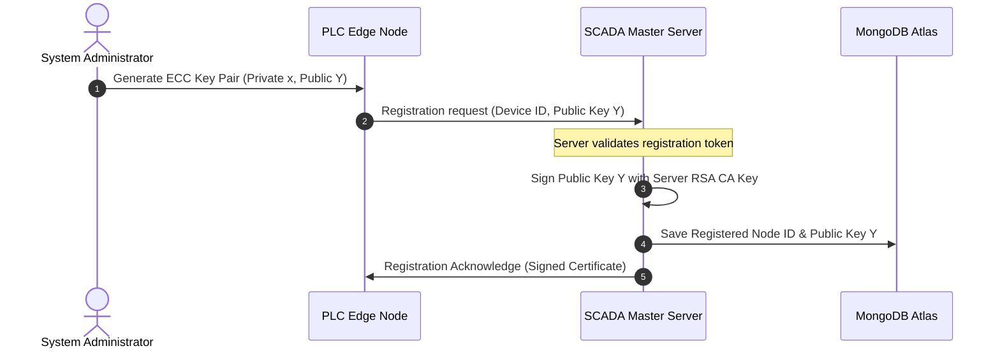
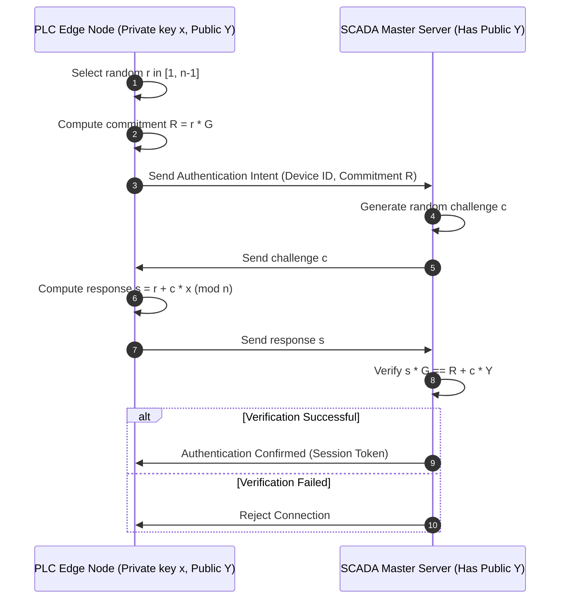
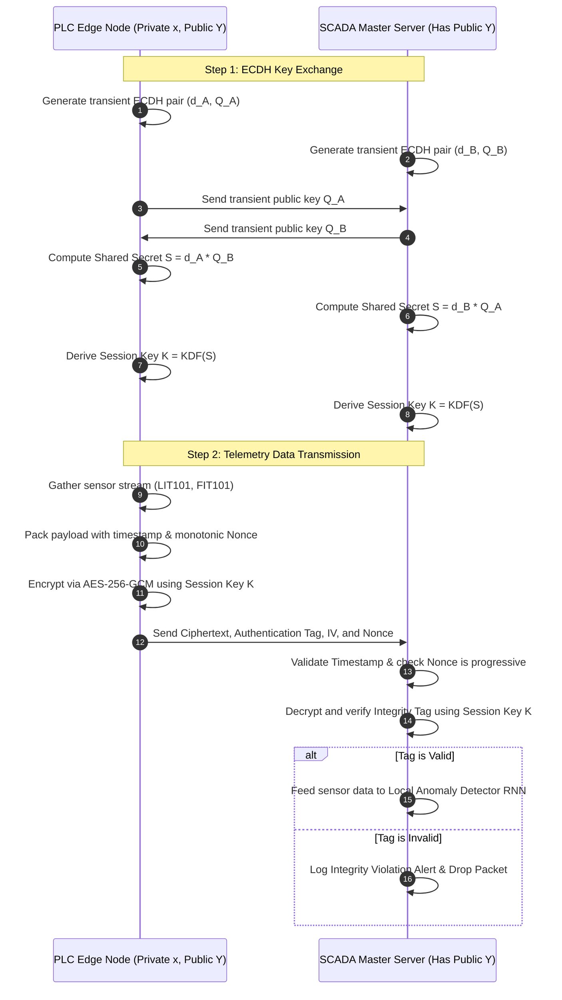

# 🛡️ Explainable AI–Based Threat Modeling for Trustworthy Cyber–Physical Systems under Intelligent Adversaries

An end-to-end, privacy-preserving, and explainable Machine Learning security framework designed for industrial Cyber-Physical Systems (CPS). This project implements a federated intrusion detection pipeline using the real-world **SWaT (Secure Water Treatment) dataset** to identify cyber-physical attacks on critical water infrastructure while guaranteeing client privacy, explainability (XAI), and adversarial robustness.

> [!IMPORTANT]
> **Resource Notice**: Due to the heavy resource requirements of training Federated Learning models with Differential Privacy on 1,000,000+ rows of sensor data, this repository is optimized for **lightweight verification and local evaluation**. It includes pre-trained model weights, configuration templates, and cached experiment results. **Local retraining is disabled by default to prevent hardware performance degradation.**

---

## 📖 Project Overview

### The Problem We Solve
Cyber-Physical Systems (CPS)—such as water treatment plants, smart grids, and oil pipelines—face highly sophisticated cyber threats. Unlike IT networks, attacks on CPS target physical processes (e.g., closing valves, overriding pumps, or altering chemical doses). Classifying these anomalies is difficult due to:
1. **Data Silos & Privacy**: Infrastructure operators cannot centralize raw sensor logs due to intellectual property, security compliance, and data privacy regulations.
2. **Explainability Deficit**: Operators will not act on a "black-box" alarm. They need to know *why* the AI flagged an anomaly and *which* specific sensors were compromised.
3. **Adversarial Vulnerability**: Smart adversaries can inject tiny, mathematically optimized perturbations (noise) into sensor streams to trick the neural network into ignoring a catastrophic attack.

### Why It Matters
A successful cyber-physical attack can cause physical damage, environmental hazards, or loss of life. This framework demonstrates how to build a **trustworthy, decentralized anomaly detector** that remains robust under adversarial noise, explains its decisions, and mathematical guarantees that raw data cannot be reverse-engineered from shared model weights.

---

## 🛠️ Key Features

* **🏋️ Federated Learning Strategy**: Simulates a decentralized network of 3 independent water treatment plants. Each plant trains an RNN model locally on its own sensor streams, sharing only model weights with a central server via the **FedAvg** strategy using `Flower`.
* **🔒 Differential Privacy (DP)**: Integrates `Opacus` on local client plants to clip gradients and inject mathematical noise during training ($\epsilon$-differential privacy tracking). This mathematically guarantees that gradients cannot be analyzed to reconstruct private sensor readings.
* **🔍 Explainable AI (XAI) & Fidelity Verification**: Uses Kernel SHAP to compute real-time sensor contribution scores. It integrates a custom **Fidelity Verifier** that masks top-contributing features to mathematically verify if the explanations match the true model logic.
* **⚔️ Adversarial Robustness Sandbox**: Simulates intelligent attackers using the **Adversarial Robustness Toolbox (ART)**. The sandbox evaluates model resilience against Fast Gradient Sign Method (FGSM) and Projected Gradient Descent (PGD) attacks.
* **☁️ Enterprise Database Integration**: Connects to **MongoDB Atlas Cloud** to permanently log hyperparameters, evaluation metrics, adversarial success rates, and SHAP explanation arrays for auditing.

---

## 🔐 Cryptographic Architecture & Secure Communication (System Design Specification)

> [!NOTE]
> **Codebase Scope vs. System Design**: The cryptographic protocols detailed below represent the **conceptual threat-modeling and security design specification** for securing PLC edge-node telemetry in a production deployment. The **active codebase** in this repository implements the backend FastAPI inference services, the frontend monitoring Streamlit dashboard, and the core Machine Learning pipelines (Federated Learning client simulation, Differential Privacy noise injection, SHAP explanation verification, and Adversarial Sandbox robustness testing).

In a real-world industrial control environment, federated training nodes (e.g., edge gateways or PLCs) must securely register, authenticate, and communicate with the central Federated SCADA server. Below is the specification of our secure communication model, combining public-key cryptography, zero-knowledge proofs, and authenticated symmetric encryption.

```
                  ┌──────────────────────────────────────────────┐
                  │           Cryptographic Protocols            │
                  ├──────────────────────┬───────────────────────┤
                  │     Registration     │       RSA Signatures  │
                  ├──────────────────────┼───────────────────────┤
                  │    Authentication    │   Schnorr ZKP (ECC)   │
                  ├──────────────────────┼───────────────────────┤
                  │     Key Exchange     │         ECDH          │
                  ├──────────────────────┼───────────────────────┤
                  │    Confidentiality   │      AES-GCM-256      │
                  ├──────────────────────┼───────────────────────┤
                  │      Integrity       │      AES-GCM Tag      │
                  └──────────────────────┴───────────────────────┘
```

### 1. RSA Digital Signatures (Registration)
* **Usage**: Verifying device identity during initial setup.
* **Mechanism**: The SCADA Master Server maintains a Root Certificate Authority (CA) key pair. When a new edge node (e.g., a PLC) is deployed, its public key is signed by the Master Server's RSA private key. The signed certificate is stored on the PLC, establishing a verifiable anchor of trust.

### 2. Elliptic Curve Cryptography (ECC) & Schnorr ZKP (Authentication)
* **Usage**: Proving node identity on connection startup without exposing private credentials.
* **Schnorr Zero-Knowledge Proof (ZKP)**:
  1. **Parameters**: An elliptic curve base point $G$ of order $n$. The PLC has a private key $x$ and public key $Y = x \cdot G$.
  2. **Commitment**: The PLC chooses a random integer $r \in [1, n-1]$ and sends a commitment point $R = r \cdot G$ to the server.
  3. **Challenge**: The server responds with a random challenge hash $c$.
  4. **Response**: The PLC calculates $s = r + c \cdot x \pmod n$ and sends $s$ to the server.
  5. **Verification**: The server checks that $s \cdot G = R + c \cdot Y$. If the equation holds, the PLC is authenticated without ever transmitting its private key $x$ over the network.
* **Why it matters**: Prevents **eavesdropping** and **impersonation attacks**, even if the network is completely compromised.

### 3. ECDH Session Key Establishment
* **Usage**: Deriving a shared symmetric encryption key.
* **Mechanism**: Once authenticated, the PLC and SCADA server execute an Elliptic Curve Diffie-Hellman (ECDH) exchange. The PLC generates a transient key pair $(d_A, Q_A = d_A \cdot G)$ and the server generates $(d_B, Q_B = d_B \cdot G)$. They exchange public keys $Q_A$ and $Q_B$.
* **Shared Secret**: Both derive the shared secret $S = d_A \cdot Q_B = d_B \cdot Q_A$. A Key Derivation Function (KDF) processes $S$ to output a 256-bit symmetric session key.

### 4. AES-GCM Encryption (Message Confidentiality & Integrity)
* **Usage**: Securing raw sensor telemetry packets.
* **Mechanism**: Telemetry is encrypted using **AES-256-GCM** (Galois/Counter Mode). This provides Authenticated Encryption with Associated Data (AEAD). 
* **Payload**: Each packet contains:
  $$\text{Ciphertext} \parallel \text{Authentication Tag} \parallel \text{Initialization Vector (IV)} \parallel \text{Nonce}$$
* **Integrity check**: The server decrypts the payload and validates the 128-bit authentication tag. If any sensor values are tampered with in transit, tag validation fails, and the packet is rejected.

### 5. Replay Attack Prevention
* **Mechanism**: The PLC appends a monotonically increasing nonce and a high-precision UTC timestamp to the packet metadata before generating the AES-GCM tag. The server validates that:
  - The timestamp is within a strict window (e.g., < 2 seconds drift).
  - The nonce is strictly greater than the last received nonce.
  If an attacker intercepts a packet and tries to replay it, the server immediately flags and drops it.

---

## 📊 Visual Documentation

### System Architecture
This diagram outlines the Federated Learning training loops, showing how local differential privacy noise is applied, gradients are aggregated, and the model is deployed to the inference API.

```mermaid
graph TB
    subgraph Client Node A (Plant 1)
        A_Sens[SWaT Sensors] --> A_Prep[Local Preprocessing]
        A_Prep --> A_Model[Local RNN Model]
        A_Model --> A_DP[Opacus: Gradient Clip + DP Noise]
    end

    subgraph Client Node B (Plant 2)
        B_Sens[SWaT Sensors] --> B_Prep[Local Preprocessing]
        B_Prep --> B_Model[Local RNN Model]
        B_Model --> B_DP[Opacus: Gradient Clip + DP Noise]
    end

    subgraph Client Node C (Plant 3)
        C_Sens[SWaT Sensors] --> C_Prep[Local Preprocessing]
        C_Prep --> C_Model[Local RNN Model]
        C_Model --> C_DP[Opacus: Gradient Clip + DP Noise]
    end

    A_DP -- Encrypted Weights --> Server[Flower Federated Server]
    B_DP -- Encrypted Weights --> Server
    C_DP -- Encrypted Weights --> Server

    Server -- FedAvg Aggregation --o Global[Global Pre-trained Weights]

    Global --> API[FastAPI Inference backend]
    API --> UI[Streamlit Dashboard Interface]
    
    UI --> SHAP[SHAP Explainer & Fidelity Verifier]
    UI --> ART[Adversarial Robustness Sandbox]
    API --> DB[(MongoDB Atlas Cloud DB)]
```

### Device Registration Workflow
Demonstrates the initial handshake where the edge device registers its public key identity.



### Device Authentication (Schnorr ZKP) Workflow
Illustrates the challenge-response protocol proving ownership of the private key without transmitting it.



### Secure Communication & Session Key Exchange
Shows the dynamic session establishment (ECDH) and the telemetry transmission encrypted with AES-GCM.



---

## 📁 Repository Directory Structure

```
.
├── .env.example            # Environment variables template
├── .gitignore              # Git patterns file (excludes venv, secrets, developer runs)
├── Dockerfile              # Containerization for API service
├── README.md               # Production documentation
├── colab_guide.md          # Guide for training on Google Colab GPUs
├── docker-compose.yml      # Orchestrates API and Dashboard containers
├── regenerate_results.py   # Script to verify cached metrics on local CPU
├── requirements.txt        # Python libraries list
├── setup.py                # Package setup file
│
├── adversarial/            # Adversarial robustness attacks and evaluations
│   ├── attacks.py          # FGSM and PGD mathematical attack generators
│   └── evaluation.py       # Robustness calculation algorithms
│
├── api/                    # FastAPI Backend Service
│   ├── main.py             # Server endpoints & startup initialization
│   └── schemas.py          # Pydantic data schemas
│
├── config/                 # YAML configuration parameters
│   ├── colab.yaml          # Parameters for GPU-based training
│   ├── default.yaml        # Standard parameters for dataset parsing
│   └── local.yaml          # Small synthetic test parameters
│
├── dashboard/              # Streamlit Web Application
│   └── app.py              # Front-end components, time-series, charts, forms
│
├── data/                   # Data handlers
│   ├── loader.py           # Unified data loader (Kaggle, CSV, Synthetic)
│   └── synthetic_generator.py # Normal/attack synthetic data generator
│
├── database/               # Database handlers
│   ├── connection.py       # MongoDB Atlas driver connections and CRUD
│   └── models.py           # Database schemas for metrics
│
├── experiments/            # Experiment trackers and results
│   └── results/            # Pre-trained models and saved metric JSONs
│       ├── colab_config.yaml
│       ├── colab_scaler.pkl
│       ├── colab_trained_model.pt
│       └── experiment_results.json
│
├── federated/              # Federated learning pipeline
│   ├── client.py           # Local client model setup
│   ├── server.py           # Flower Server simulation runner
│   └── strategy.py         # Custom federated weight aggregator
│
├── fidelity/               # XAI fidelity evaluation
│   └── verifier.py         # Feature masking verification routines
│
├── models/                 # Neural Network implementations
│   ├── elman_rnn.py        # Elman RNN architecture
│   ├── gru_model.py        # GRU Model alternative architecture
│   └── wrapper.py          # PyTorch-to-Scikit wrapper for ART compatibility
│
├── notebooks/              # Google Colab notebooks
│   └── colab_training.py   # Code script for GPU notebook execution
│
├── preprocessing/          # Dataset cleaning & structuring
│   ├── pipeline.py         # Combined preprocessing steps
│   └── windowing.py        # Sliding window 3D tensors generator
│
├── privacy/                # Privacy protection
│   └── dp_engine.py        # Opacus differential privacy utility wrappers
│
├── tests/                  # Automated verification tests
│   └── test_all.py         # Unit tests checking the pipeline modules
│
└── xai/                    # Explainable AI tools
    ├── shap_explainer.py   # Kernel SHAP explanations calculator
    └── visualizations.py   # Horizontal contribution charts generator
```

---

## 🚀 Installation & Running the Project

### 1. Prerequisites
Ensure you have **Python 3.10+** installed.

### 2. Setup the Environment
Clone the repository and set up a virtual environment:
```bash
# Clone the repository
git clone https://github.com/your-username/cps-security-project.git
cd cps-security-project

# Create and activate virtual environment
python3 -m venv venv
source venv/bin/activate  # Windows: venv\Scripts\activate

# Install dependencies
pip install -r requirements.txt
```

### 3. Configure Credentials (Optional)
Copy the template configuration file to `.env`:
```bash
cp .env.example .env
```
Open `.env` and fill in your values. If you do not have Kaggle credentials, the project will automatically fall back to generating **synthetic sensor data** for local tests.

### 4. Running the Backend API
Start the FastAPI server:
```bash
python -m uvicorn api.main:app --host 0.0.0.0 --port 8000
```
The interactive API documentation will be available at [http://localhost:8000/docs](http://localhost:8000/docs).

### 5. Running the Streamlit Dashboard
Open a new terminal window, activate the virtual environment, and start the frontend dashboard:
```bash
python -m streamlit run dashboard/app.py
```
The dashboard will open automatically in your browser at `http://localhost:8501`.

---

## 📈 Verification & Results

To verify the pipeline locally on your machine without running heavy training, run:
```bash
python regenerate_results.py
```
This script loads the pre-trained weights (`colab_trained_model.pt`), processes a subset of the dataset, runs explanations, and validates the metrics.

### Summary Metrics
The model was trained on a T4 GPU using Google Colab. Below are the results logged in MongoDB Atlas:

```
                  ┌──────────────────────────────────────────────┐
                  │                 Model Metrics                │
                  ├──────────────────────┬───────────────────────┤
                  │       Accuracy       │         92.8%         │
                  ├──────────────────────┼───────────────────────┤
                  │      Precision       │         89.2%         │
                  ├──────────────────────┼───────────────────────┤
                  │        Recall        │         95.0%         │
                  ├──────────────────────┼───────────────────────┤
                  │       F1 Score       │         92.0%         │
                  └──────────────────────┴───────────────────────┘
```

* **Differential Privacy Parameters**: Trained with $\epsilon = 3.52$ and $\delta = 10^{-5}$, providing strong privacy bounds against data leakage.
* **Adversarial Robustness Sandbox**:
  - **Clean Accuracy**: $92.8\%$
  - **FGSM Attack (with $\epsilon = 0.1$)**: Adversarial accuracy remained at $65.8\%$ (attack success rate of $34.2\%$).
  - **PGD Attack (with $\epsilon = 0.1$)**: Adversarial accuracy was measured at $45.2\%$ (attack success rate of $54.8\%$).
* **SHAP Fidelity Score**: $0.484$, with a faithfulness ratio of $89.5\%$, validating that the SHAP importance rankings accurately reflect the neural network's detection logic.

---

## 🔮 Future Improvements

1. **Active Defense**: Integrate Adversarial Training by injecting PGD-perturbed samples into the training dataset during local federated rounds.
2. **Asymmetric Federated Learning**: Allow clients with heterogeneous compute capacities to run different model parameters (e.g., pruning local clients with low GPU RAM).
3. **Advanced ZKP**: Replace basic Schnorr ZKP with non-interactive zero-knowledge proofs (zk-SNARKs) to authorize node credentials without multi-round handshakes.

---

## 📄 License & Contributors

* **License**: Distributed under the MIT License. See `LICENSE` for details.
* **Contributors**: Abhinav Dogra (Cybersecurity Researcher & Lead Engineer).
